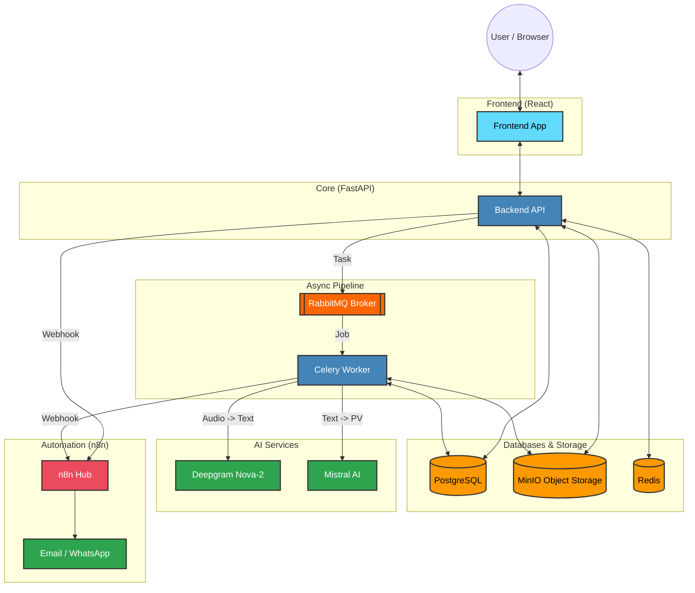

# System Architecture for Meeting Automation System

## 1. Overview

The Meeting Automation System is a microservices-based application designed to automate various aspects of meeting management, including transcription, minute generation (PV - Procès-Verbal), action item tracking, and reporting. It is optimized for the Tunisia/Maghreb market with multilingual support (Arabic, French, English) and WhatsApp integration.

## 2. High-Level Architecture

The system is composed of several loosely coupled services that communicate primarily via REST APIs and message queues. Docker and Docker Compose are used for local development, with Kubernetes and Terraform for production deployment.

## 3. Component Breakdown

### 3.1. Frontend (React/TypeScript)

- **Technology**: React 18, TypeScript, Material-UI, Redux Toolkit, i18next.
- **Purpose**: Provides a rich user interface for managing meetings, viewing transcriptions, tracking actions, and accessing reports.
- **Key Features**:
    - User authentication and MFA setup.
    - Meeting scheduling and management.
    - Real-time display of recording controls and transcription viewer.
    - Action item tracking and status updates.
    - Dynamic dashboards for different user roles (DG, Manager, Participant).
    - Multilingual support with RTL layout adaptation.

### 3.2. Backend (FastAPI/Python)

- **Technology**: FastAPI, Python 3.11, PostgreSQL, SQLAlchemy, Alembic, Redis, Celery, RabbitMQ.
- **Purpose**: Core business logic, API endpoints, data persistence, and integration with AI and external services.
- **Key Modules**:
    - `app.api.v1`: Defines all REST API endpoints for authentication, meetings, recordings, transcriptions, PV, actions, and reports.
    - `app.core`: Configuration, database connection, security utilities (JWT, password hashing), and logging.
    - `app.models`: SQLAlchemy ORM models defining the database schema.
    - `app.schemas`: Pydantic models for request/response validation.
    - `app.services`: Business logic for various domains (meeting, transcription, PV, action, report, security).
    - `app.tasks`: Celery tasks for asynchronous operations (email notifications, transcription processing, data retention).
    - `app.middleware`: Custom middleware, including ISO 27001 compliant audit logging.
- **Database**: PostgreSQL for relational data.
- **Caching/Broker**: Redis used as a cache and as a broker for Celery tasks.

### 3.3. AI Services (Python/FastAPI)

- **Technology**: FastAPI, Python, PyTorch, Transformers.
- **Purpose**: Provides specialized AI functionalities to the backend.
- **Services**:
    - **Whisper (Speech-to-Text)**:
        - Transcribes audio recordings into text.
        - Supports multiple languages including French, Arabic, and English, with code-switching capabilities.
    - **Mistral (NLP for PV Generation)**:
        - Processes transcribed text to identify key discussion points, decisions, and action items.
        - Generates structured procès-verbaux (PVs) and summaries.
        - Optimized for Arabic language understanding.
- **Deployment**: Each AI service runs in its own Docker container, exposing a REST API.

### 3.4. n8n (Workflow Automation)

- **Technology**: n8n (Node.js based workflow automation tool).
- **Purpose**: Automates complex business workflows and integrates with various external services.
- **Key Workflows**:
    - `meeting-created.json`: Triggered when a new meeting is created (e.g., sends confirmation emails).
    - `audio-uploaded.json`: Triggered after a recording is uploaded (e.g., initiates transcription, notifies users).
    - `pv-validated.json`: Triggered when a PV is validated (e.g., distributes the PV, updates action items).
    - `daily-reminders.json`: Sends daily reminders for upcoming meetings or pending action items via WhatsApp/Email.
- **Integration**: Connects to the Backend API via webhooks and external APIs like WhatsApp Business API and Email (SendGrid).

### 3.5. Infrastructure

- **Docker/Docker Compose**: Used for local development and simplified deployment of multi-service applications.
    - `docker-compose.yml`: Defines all services (PostgreSQL, Redis, RabbitMQ, Minio, n8n, Backend, Celery Workers, Frontend).
- **Kubernetes**: Orchestrates containerized applications in production environments.
    - `namespace.yaml`: Defines the Kubernetes namespace.
    - `backend-deployment.yaml`, `frontend-deployment.yaml`: Deployment configurations for backend and frontend.
    - `postgres-statefulset.yaml`, `redis-deployment.yaml`: Deployments for stateful services.
    - `ingress.yaml`: Manages external access to services.
- **Terraform**: Manages cloud infrastructure (e.g., provision Kubernetes cluster, databases, S3 buckets).
    - `main.tf`, `variables.tf`, `outputs.tf`: Terraform configuration files.
- **Minio (S3-compatible Object Storage)**:
    - **Purpose**: Stores meeting recordings and other large files.
    - **Integration**: Backend interacts with Minio via the S3 API (Boto3 library).

## 4. CI/CD Pipelines (.github/workflows)

- **Backend CI (`backend-ci.yml`)**:
    - Triggers on push/pull request to `main`/`develop` branches within the `backend/` directory.
    - Runs tests (pytest), linting (flake8), type checking (mypy).
    - Builds Docker image and performs Trivy vulnerability scanning.
- **Frontend CI (`frontend-ci.yml`)**:
    - Triggers on push/pull request to `main`/`develop` branches within the `frontend/` directory.
    - Installs dependencies, runs linting (ESLint), type checking (TypeScript), and builds the frontend application.
    - Builds Docker image for the frontend.
- **Docker Build (`docker-build.yml`)**:
    - A general workflow for building and potentially pushing Docker images (not fully detailed in the provided schema, but typically handles multi-service image builds and registry pushes).

## 5. Security & Compliance (ISO 27001)

- **Audit Middleware**: The backend includes middleware to log all significant user actions, forming a comprehensive audit trail.
- **Data Encryption**: Sensitive data at rest and in transit is encrypted using cryptography.
- **Authentication**: JWT-based authentication with refresh tokens and multi-factor authentication (MFA).
- **Access Control**: Role-based access control (RBAC) to ensure users only access authorized resources.
- **Vulnerability Scanning**: Docker images are scanned for vulnerabilities using Trivy in CI/CD pipelines.

## 6. Cultural Adaptations (Tunisia/Maghreb)

- **Multilingual Support**: Frontend and AI services support Arabic (Tunisian and MSA), French, and English, including code-switching in transcription.
- **RTL Layout**: Frontend implements Right-to-Left (RTL) layout for Arabic languages.
- **Cultural Calendar**: Frontend incorporates cultural calendar features relevant to the region.
- **WhatsApp Integration**: Leverages WhatsApp Business API for notifications and reminders, recognizing its high adoption rate in Tunisia.