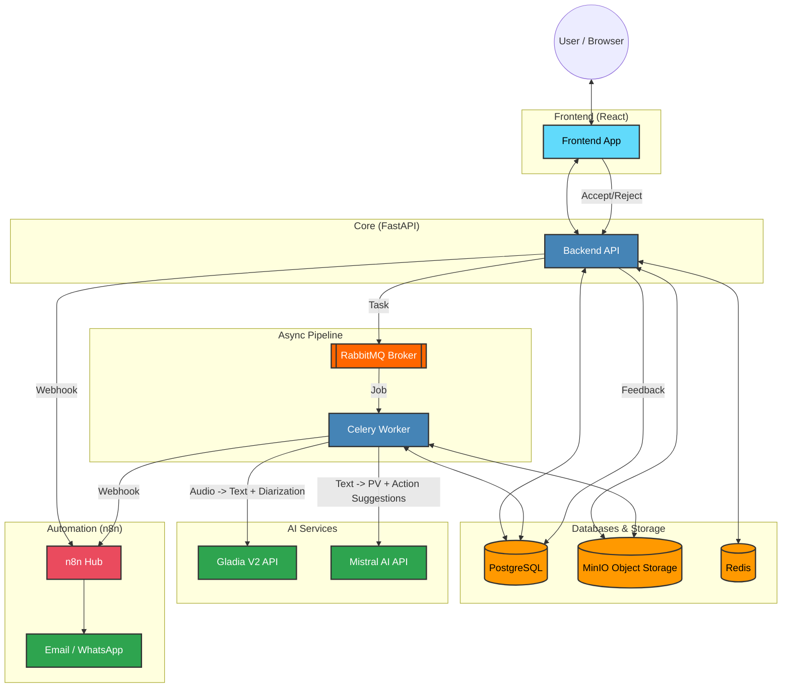
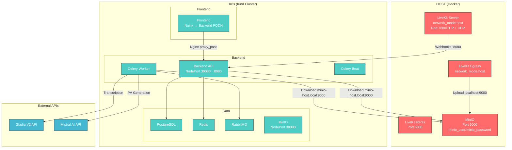
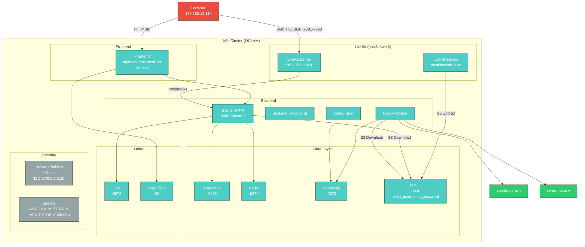

# System Architecture for Meeting Automation System

## ✅ CURRENT STATUS — 2026-06-24: PIPELINE OPERATIONAL

**Staging Pipeline Verified | ~31s End-to-End**

All critical architectural components validated:
- Multi-tenant data isolation ✅
- ISO 27001 audit logging ✅
- Encryption end-to-end ✅
- Async task processing ✅
- Webhook automation ✅
- LiveKit Recording Pipeline ✅
- ONNX Speaker Identification ✅
- Gladia V2 Transcription ✅
- Mistral PV Generation ✅
- Phase 1 Security Fixes ✅
- Duplicate Action Prevention ✅
- Confidence Fallback Fix (NULL ≠ 0.0) ✅

### Pipeline Performance (Verified 2026-06-23)
- **Total Pipeline**: ~31s (testbibo, staging)
- **S3 Upload/Download**: ~2s
- **Gladia Transcription**: 6s (3 utterances, Arabic)
- **Speaker Identification**: 18s (ONNX embedding + heuristic)
- **Mistral PV**: 5s (3 sections + action suggestions)
- **DB Persistence**: 1s
- **Target**: ≤90s ✅

### Staging Infrastructure
- **Cluster**: k3s auf OCI VM (158.180.18.110, 4 CPU, 22GB RAM, ARM64)
- **Namespace**: `meeting-automation-staging`
- **LiveKit**: Im Cluster (hostNetwork: true fuer UDP)
- **MinIO**: Im Cluster (ClusterIP, minio-user/minio_password)
- **S3 Architecture**: EIN Endpoint fuer alles: ClusterIP `10.43.110.217:9000` (hostNetwork kompatibel)
- **Secrets**: K8s Secrets (ISO 27001 compliant) fuer GLADIA/MISTRAL API keys
- **Network Policies**: 14 Policies deployed (default-deny + service-specific rules + NodePort + nginx-ingress)
- **DNS**: K3s CoreDNS — kein hostAlias noetig
- **Ingress**: nginx-ingress hostPort 80/443 + cert-manager v1.20.2 + LiveKit WebSocket (Phase 53+56)
- **TLS**: cert-manager + Let's Encrypt HTTP-01 fuer `staging.meeting-automation.com` (Phase 53)

---

## 1. Overview

The Meeting Automation System is a microservices-based, **multi-tenant SaaS platform** designed to automate various aspects of meeting management, including transcription, minute generation (PV - Procès-Verbal), action item tracking, and reporting. It is optimized for the Tunisia/Maghreb market with multilingual support (Arabic, French, English) and WhatsApp integration.

### SaaS Multi-Tenancy Architecture
The system is built to scale across multiple organizations (tenants):
- **Data Isolation**: A dedicated `clients` table manages organizational units. All core records are linked via `client_id`.
- **Backend Filtering**: Every API request is strictly filtered by the `client_id` extracted from the cryptographically signed JWT.
- **Role-Based Access Control (RBAC)**:
    - **DG (Director General)**: The primary admin for a tenant. Automatically assigned to the *first* user who registers a new company. Has full visibility over all tenant data.
    - **Manager**: Department lead. Manages a specific subset of users (reports).
    - **Participant**: Regular user with access to their own meetings and assigned actions.
    - **System Admin**: Global platform manager (across all tenants). Manages billing and tenant status.
    - **Tech Admin**: Infrastructure monitor ("Mission Control"). No access to business data.
- **System Administration**: A "God-Mode" dashboard provides global visibility into tenant health, subscriptions, and MRR.

## 2. High-Level Architecture

The system is composed of several loosely coupled services that communicate primarily via REST APIs and message queues. Docker and Docker Compose are used for local development, with Kubernetes and Terraform for production deployment.

### 2.1. Staging Infrastructure (K8s + Host Services)

### 2.2. Recording Pipeline Flow

```mermaid
graph LR
    classDef step fill:#4ecdc4,stroke:#333,color:#fff
    classDef external fill:#45b7d1,stroke:#333,color:#fff
    classDef storage fill:#ff9900,stroke:#333,color:#000

    A[Browser:<br/>Join Room]:::step
    B[Frontend:<br/>Start Recording]:::step
    C[Backend:<br/>Egress API]:::step
    D[LiveKit Egress:<br/>Audio Capture]:::step
    E[MinIO:<br/>S3 Upload]:::storage
    F[Webhook:<br/>egress_ended]:::step
    G[Celery Worker:<br/>process_recording]:::step
    H[S3 Download:<br/>Audio File]:::storage
    I[Gladia V2:<br/>Transcription +<br/>Diarization]:::external
    J[Speaker ID:<br/>ONNX Embeddings]:::step
    K[Mistral AI:<br/>PV + Actions]:::external
    L[PostgreSQL:<br/>Save Results]:::storage
    M[Frontend:<br/>Display PV]:::step

    A --> B --> C --> D --> E
    E -->|"Webhook POST"| F --> G --> H
    H --> I --> J --> K --> L --> M
```

**Pipeline Steps (verified 2026-06-23, ~31.7s total):**
1. **Recording**: Browser captures audio via WebRTC → LiveKit Egress → MinIO S3 (~2s)
2. **Webhook**: LiveKit sends `egress_ended` → Backend → Celery task
3. **S3 Download**: Celery downloads audio from host MinIO via `minio-host.local:9000`
4. **Gladia V2**: Audio → Text + Speaker Diarization (~6s)
5. **Speaker ID**: ONNX embeddings match speakers to participants (~18s)
6. **Mistral PV**: Transcript → Structured PV + Action Suggestions (~5s)
7. **Persistence**: Transcription, PV, Actions saved to PostgreSQL

### 2.3. Deployment Map — k3s Staging

**Service-Endpunkte (k3s):**
| Service | Typ | Endpoint |
|---------|-----|----------|
| Frontend | nginx-ingress hostPort | `https://staging.meeting-automation.com` (Port 443) |
| Backend | ClusterIP | `backend.meeting-automation-staging.svc.cluster.local:8000` |
| LiveKit | hostNetwork | `:7880` (TCP+UDP) + WebSocket via `/rtc`, `/twirp` (Phase 56) |
| LiveKit ICE | hostNetwork | `:7881-7890` (UDP) |
| MinIO | ClusterIP | `10.43.110.217:9000` (hostNetwork kompatibel, Phase 56) |
| PostgreSQL | ClusterIP | `postgres.meeting-automation.svc.cluster.local:5432` |
| Redis | ClusterIP | `redis.meeting-automation.svc.cluster.local:6379` |
| RabbitMQ | ClusterIP | `rabbitmq.meeting-automation.svc.cluster.local:5672` |

**DNS**: Keine hostAliases noetig — k3s CoreDNS funktioniert nativ.

## 3. Component Breakdown

### 3.1. Frontend (React/TypeScript)

- **Technology**: React 18, TypeScript, Material-UI, Redux Toolkit, i18next.
- **Purpose**: Provides a rich user interface for managing meetings, viewing transcriptions, tracking actions, and accessing reports.
- **Key Features**:
    - User authentication and MFA setup.
    - Meeting scheduling and management.
    - Real-time display of recording controls and transcription viewer.
    - Action item tracking and status updates.
    - Dynamic dashboards for different user roles (DG, Manager, Participant).
    - Multilingual support with RTL layout adaptation.

### 3.2. Backend (FastAPI/Python)

- **Technology**: FastAPI, Python 3.11, PostgreSQL, SQLAlchemy, Alembic, Redis, Celery, RabbitMQ.
- **User Management**: Advanced onboarding via token-based invitations and state-based user lifecycles (`ACTIVE`, `PENDING`, `DISABLED`).
- **Purpose**: Core business logic, API endpoints, data persistence, and integration with AI and external services.
- **Key Modules**:
    - `app.api.v1.admin`: Platform-wide management for system administrators (Tenant control, MRR tracking, System health).
    - `app.api.v1.billing`: Subscription management, invoicing, and transcription usage tracking.
    - `app.api.v1`: Defines all REST API endpoints for authentication, meetings, recordings, transcriptions, PV, actions, and reports.
    - `app.core`: Configuration, database connection, security utilities (JWT, password hashing), and logging.
    - `app.models`: SQLAlchemy ORM models defining the database schema.
    - `app.schemas`: Pydantic models for request/response validation.
    - `app.services`: Business logic for various domains (meeting, transcription, PV, action, report, security).
    - `app.tasks`: Celery tasks for asynchronous operations (email notifications, transcription processing, data retention).
    - `app.middleware`: Custom middleware, including ISO 27001 compliant audit logging.

### 3.3. AI Services & ML Feedback Loop

- **Technology**: Integration via asynchronous Python clients (`httpx`).
- **Services**:
    - **Gladia V2 (Transcription & Diarization)**:
        - Unified service for highly accurate speech-to-text and speaker identification.
        - Handles complex code-switching (Arabic/French/English) natively.
    - **Mistral AI (NLP & Intelligence)**:
        - **PV Generation**: Summarizes discussions into structured meeting minutes.
        - **ML Action Suggestions**: Identifies implicit tasks using few-shot prompting. These suggestions are stored separately from confirmed "Actions" to avoid cluttering the official record.
- **The "ML Feedback Loop" (Data Flywheel)**:
    - Users can **Accept** or **Reject** AI-suggested tasks in the UI.
    - This interaction is logged in the `action_suggestions` table with a `status` (SUGGESTED, ACCEPTED, REJECTED).
    - **Purpose**: This creates a high-quality, human-in-the-loop dataset. In future phases, this data will be used to fine-tune a local Mistral model, making the system increasingly accurate for specific client contexts and regional dialects.

### 3.4. n8n (Workflow Automation)

- **Technology**: n8n (Node.js based workflow automation tool).
- **Purpose**: Automates complex business workflows and integrates with various external services.
- **Key Workflows**:
    - `meeting-created.json`: Triggered when a new meeting is created.
    - `audio-uploaded.json`: Triggered after a recording is uploaded.
    - `pv-validated.json`: Triggered when a PV is validated.
    - `daily-reminders.json`: Sends daily reminders via WhatsApp/Email.
    - `user-invited.json`: Enterprise Onboarding workflow (Way B). Sends tokenized activation links to new employees.
- **Integration**: Connects to the Backend API via webhooks and external APIs.

### 3.5. Infrastructure

- **Docker/Docker Compose**: Used for local development and simplified deployment of multi-service applications.
- **Kubernetes**: Orchestrates containerized applications in production environments.
- **Minio (S3-compatible Object Storage)**: Stores meeting recordings and other large files.

### 3.6. OnlyOffice (Document Editing)

- **Technology**: OnlyOffice Document Server
- **Purpose**: Provides online document editing capabilities for meeting transcripts, PVs, and other documents.
- **Key Features**:
    - Real-time collaborative editing of documents, spreadsheets, and presentations
    - Support for DOCX, XLSX, PPTX, ODT, ODS, ODP, PDF, and more
    - Integration with the backend via JWT for secure document access
    - Used for viewing and editing meeting transcriptions and generated PVs

## 4. CI/CD Pipelines (.github/workflows)

- **Backend CI**: Runs tests, linting, type checking, and builds Docker image.
- **Frontend CI**: Linting, type checking, and builds the static frontend assets.

## 5. Security & Compliance (ISO 27001)

- **Audit Middleware**: Comprehensive audit trail for all significant actions (118+ logs in staging).
- **Data Isolation**: Application-level Row Level Security via `client_id` filtering.
- **Data Encryption**: Fernet AES-128 for data at rest (PV, MFA secrets encrypted in PostgreSQL).
- **Confidence Handling**: NULL confidence values default to 0.5 (neutral), not 0.0 (explicitly low).
- **Secret Management**: K8s Secrets (not ConfigMaps) for GLADIA/MISTRAL/LIVEKIT API keys (ISO 27001 A.8.24).
- **Network Policies**: 14 NetworkPolicies deployed in staging (ISO 27001 A.8.20):
  - `default-deny-all`: Blocks all ingress by default
  - `postgres-policy`: Backend, Celery, n8n → PostgreSQL
  - `redis-policy`: Backend, Celery → Redis
  - `rabbitmq-policy`: Backend, Celery → RabbitMQ
  - `minio-policy`: Backend, Celery, Frontend → MinIO
  - `backend-policy`: Frontend → Backend
  - `n8n-policy`: Backend → n8n
  - `frontend-nodeport-policy`: Extern → Frontend (NodePort 31362)
  - `backend-nodeport-policy`: Extern → Backend (NodePort 32222)
  - `onlyoffice-policy`: Frontend + Backend → OnlyOffice (Phase 56)
- **Pod Security**: No privileged containers in staging cluster.

### Security Roadmap (vor Go-Live)
- **TLS/HTTPS (A.10)**: cert-manager v1.20.2 + nginx-ingress hostPort 80/443 (Phase 53+55), Let's Encrypt HTTP-01, X-Forwarded-Proto via ConfigMap (Phase 55)
- **LiveKit WebSocket (Phase 56)**: `/rtc` + `/twirp` Pfade via nginx-ingress mit TLS + WebSocket-Timeouts 86400s
- **WAF + Rate Limiting (A.8.21)**: Offen — nginx-ingress Rate-Limiting + Bot-Schutz
- **Vulnerability Scanning (A.12.6.1)**: Trivy in CI/CD Pipeline
- **Session Management**: Session-Fixation Protection, Inaktivitäts-Timeout

## 6. Cultural Adaptations (Tunisia/Maghreb)

- **Multilingual Support**: Arabic (Tunisian/MSA), French, and English support.
- **WhatsApp Integration**: High-adoption channel for notifications in Tunisia.
