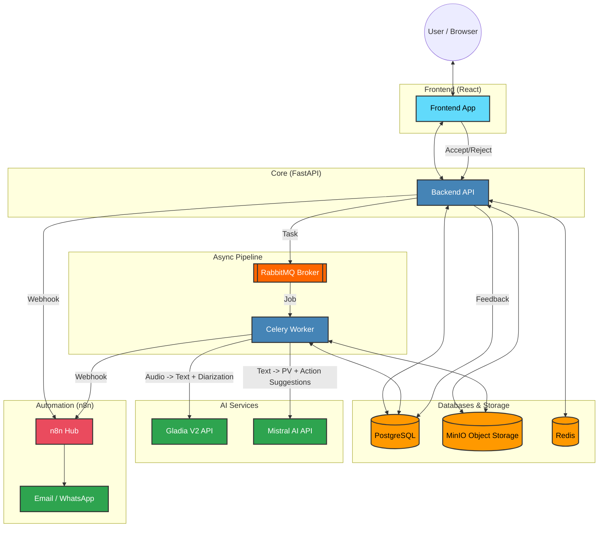

# System Architecture for Meeting Automation System

## 1. Overview

The Meeting Automation System is a microservices-based, **multi-tenant SaaS platform** designed to automate various aspects of meeting management, including transcription, minute generation (PV - Procès-Verbal), action item tracking, and reporting. It is optimized for the Tunisia/Maghreb market with multilingual support (Arabic, French, English) and WhatsApp integration.

### SaaS Multi-Tenancy Architecture
The system is built to scale across multiple organizations (tenants):
- **Data Isolation**: A dedicated `clients` table manages organizational units. All core records are linked via `client_id`.
- **Backend Filtering**: Every API request is strictly filtered by the `client_id` extracted from the cryptographically signed JWT.
- **System Administration**: A "God-Mode" dashboard provides global visibility into tenant health, subscriptions, and MRR.

## 2. High-Level Architecture

The system is composed of several loosely coupled services that communicate primarily via REST APIs and message queues. Docker and Docker Compose are used for local development, with Kubernetes and Terraform for production deployment.

## 3. Component Breakdown

### 3.1. Frontend (React/TypeScript)

- **Technology**: React 18, TypeScript, Material-UI, Redux Toolkit, i18next.
- **Purpose**: Provides a rich user interface for managing meetings, viewing transcriptions, tracking actions, and accessing reports.
- **Key Features**:
    - User authentication and MFA setup.
    - Meeting scheduling and management.
    - Real-time display of recording controls and transcription viewer.
    - Action item tracking and status updates.
    - Dynamic dashboards for different user roles (DG, Manager, Participant).
    - Multilingual support with RTL layout adaptation.

### 3.2. Backend (FastAPI/Python)

- **Technology**: FastAPI, Python 3.11, PostgreSQL, SQLAlchemy, Alembic, Redis, Celery, RabbitMQ.
- **Purpose**: Core business logic, API endpoints, data persistence, and integration with AI and external services.
- **Key Modules**:
    - `app.api.v1.admin`: Platform-wide management for system administrators (Tenant control, MRR tracking, System health).
    - `app.api.v1.billing`: Subscription management, invoicing, and transcription usage tracking.
    - `app.api.v1`: Defines all REST API endpoints for authentication, meetings, recordings, transcriptions, PV, actions, and reports.
    - `app.core`: Configuration, database connection, security utilities (JWT, password hashing), and logging.
    - `app.models`: SQLAlchemy ORM models defining the database schema.
    - `app.schemas`: Pydantic models for request/response validation.
    - `app.services`: Business logic for various domains (meeting, transcription, PV, action, report, security).
    - `app.tasks`: Celery tasks for asynchronous operations (email notifications, transcription processing, data retention).
    - `app.middleware`: Custom middleware, including ISO 27001 compliant audit logging.

### 3.3. AI Services & ML Feedback Loop

- **Technology**: Integration via asynchronous Python clients (`httpx`).
- **Services**:
    - **Gladia V2 (Transcription & Diarization)**:
        - Unified service for highly accurate speech-to-text and speaker identification.
        - Handles complex code-switching (Arabic/French/English) natively.
    - **Mistral AI (NLP & Intelligence)**:
        - **PV Generation**: Summarizes discussions into structured meeting minutes.
        - **ML Action Suggestions**: Identifies implicit tasks using few-shot prompting. These suggestions are stored separately from confirmed "Actions" to avoid cluttering the official record.
- **The "ML Feedback Loop" (Data Flywheel)**:
    - Users can **Accept** or **Reject** AI-suggested tasks in the UI.
    - This interaction is logged in the `action_suggestions` table with a `status` (SUGGESTED, ACCEPTED, REJECTED).
    - **Purpose**: This creates a high-quality, human-in-the-loop dataset. In future phases, this data will be used to fine-tune a local Mistral model, making the system increasingly accurate for specific client contexts and regional dialects.

### 3.4. n8n (Workflow Automation)

- **Technology**: n8n (Node.js based workflow automation tool).
- **Purpose**: Automates complex business workflows and integrates with various external services.
- **Key Workflows**:
    - `meeting-created.json`: Triggered when a new meeting is created (e.g., sends confirmation emails).
    - `audio-uploaded.json`: Triggered after a recording is uploaded (e.g., initiates transcription, notifies users).
    - `pv-validated.json`: Triggered when a PV is validated (e.g., distributes the PV, updates action items).
    - `daily-reminders.json`: Sends daily reminders for upcoming meetings or pending action items via WhatsApp/Email.
- **Integration**: Connects to the Backend API via webhooks and external APIs like WhatsApp Business API and Email (SendGrid).

### 3.5. Infrastructure

- **Docker/Docker Compose**: Used for local development and simplified deployment of multi-service applications.
- **Kubernetes**: Orchestrates containerized applications in production environments.
- **Minio (S3-compatible Object Storage)**: Stores meeting recordings and other large files.

## 4. CI/CD Pipelines (.github/workflows)

- **Backend CI**: Runs tests, linting, type checking, and builds Docker image.
- **Frontend CI**: Linting, type checking, and builds the static frontend assets.

## 5. Security & Compliance (ISO 27001)

- **Audit Middleware**: Comprehensive audit trail for all significant actions.
- **Data Isolation**: Application-level Row Level Security via `client_id` filtering.
- **Data Encryption**: AES-256 for data at rest, TLS for data in transit.

## 6. Cultural Adaptations (Tunisia/Maghreb)

- **Multilingual Support**: Arabic (Tunisian/MSA), French, and English support.
- **WhatsApp Integration**: High-adoption channel for notifications in Tunisia.
