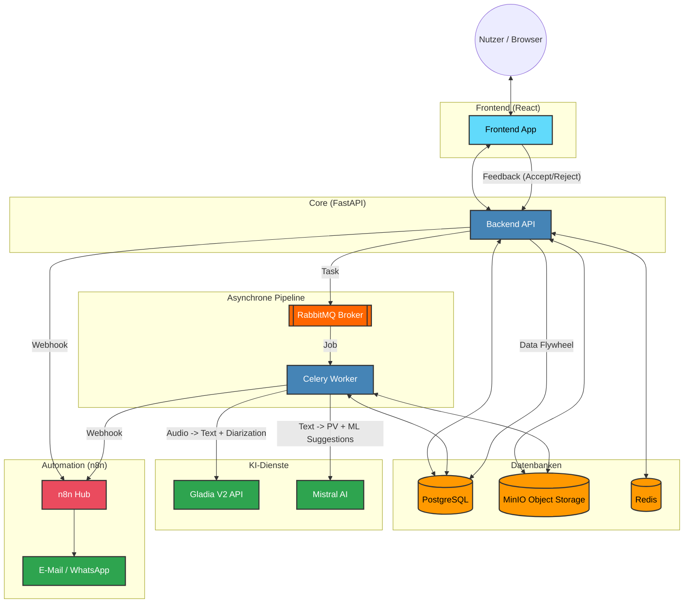

# Projekt-Architektur Diagramm

Dieses Diagramm zeigt den aktuellen, stabilisierten Datenfluss des Meeting Automation Systems.

### Kurzbeschreibung:
1. **Frontend**: React-App für Nutzerinteraktion. Enthält den Feedback-Mechanismus für KI-Vorschläge.
2. **Backend**: FastAPI für Logik, S3-Management und Verarbeitung des Nutzer-Feedbacks.
3. **Pipeline**: Celery/RabbitMQ für langlaufende KI-Aufgaben (Gladia/Mistral).
4. **KI**: **Gladia V2** (Transkription & Sprechererkennung) & **Mistral** (Zusammenfassung & intelligente Aufgabenvorschläge).
5. **Feedback Loop**: Die Interaktion der Nutzer mit den KI-Vorschlägen wird in der DB gespeichert, um einen Datensatz für zukünftiges Fine-Tuning zu erstellen (ML Feedback Loop).
6. **n8n**: Zentraler Hub für den Versand von E-Mails und Benachrichtigungen.
