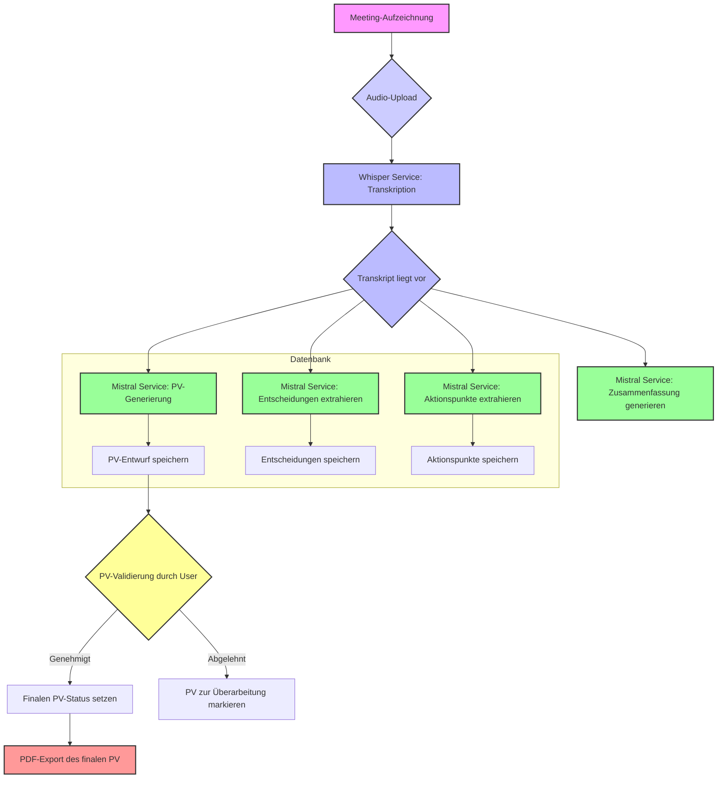

# Pipeline Funktionalitätsdiagramm

Dieses Diagramm beschreibt den End-to-End-Workflow von der Aufzeichnung eines Meetings bis zur Erstellung und zum Export des Protokolls (PV).

## Beschreibung der Schritte

1.  **Meeting-Aufzeichnung**: Der Prozess beginnt mit einer Audioaufzeichnung eines Meetings.
2.  **Audio-Upload**: Die Aufzeichnungsdatei wird auf den Server hochgeladen.
3.  **Whisper Service**: Der Whisper-Client verarbeitet die Audiodatei und wandelt die gesprochene Sprache in Text um (Transkription).
4.  **Mistral Service**: Sobald das Transkript verfügbar ist, wird es parallel an den Mistral-Client gesendet, um mehrere Aufgaben auszuführen:
    -   **PV-Generierung**: Erstellt einen ersten Entwurf des Protokolls.
    -   **Entscheidungen extrahieren**: Identifiziert und listet alle im Meeting getroffenen Entscheidungen auf.
    -   **Aktionspunkte extrahieren**: Identifiziert und listet alle zugewiesenen Aufgaben oder Aktionspunkte auf.
    -   **Zusammenfassung generieren**: Erstellt eine kurze Zusammenfassung des Meetings.
5.  **Datenbank-Speicherung**: Die generierten Informationen (PV-Entwurf, Entscheidungen, Aktionspunkte) werden in der Datenbank gespeichert.
6.  **PV-Validierung**: Ein autorisierter Benutzer (z. B. ein DG) überprüft den PV-Entwurf. Er kann ihn genehmigen oder zur Überarbeitung zurückweisen.
7.  **PDF-Export**: Nach der Genehmigung kann das endgültige Protokoll als PDF-Datei exportiert werden.