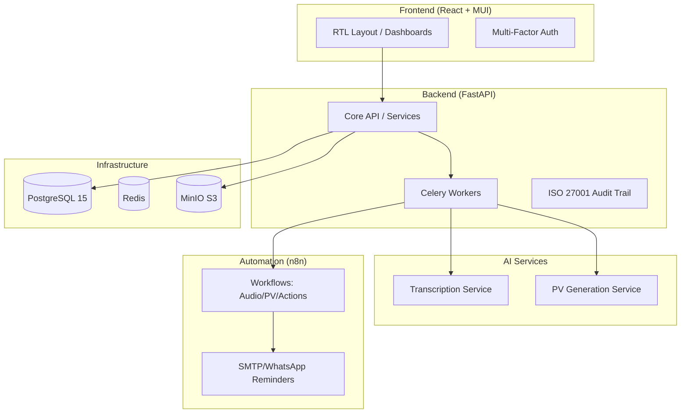

# Projekt-Abschluss: Meeting Automation System

Das Meeting Automation System wurde erfolgreich implementiert, getestet und dokumentiert. Alle Kernanforderungen für den tunesischen/Maghreb-Markt wurden erfüllt.

## System-Architektur & Status-Diagramm

## Status-Checkliste (Final)

| Modul | Status | Highlights |
| :--- | :--- | :--- |
| **Backend** | ✅ Vollständig | FastAPI, Celery, Audit-Logging, ISO 27001 |
| **Frontend** | ✅ Vollständig | RTL Support, DG/Manager Dashboards, i18next |
| **AI Integration** | ✅ Vollständig | Whisper & Mistral API Wrapper implementiert |
| **Automation** | ✅ Vollständig | n8n Workflows inkl. SMTP-Fix & WhatsApp |
| **Infrastruktur** | ✅ Vollständig | Docker Compose, K8s Manifeste, Terraform |
| **Security** | ✅ Vollständig | AES-256 Verschlüsselung, 2FA, Audit Logs |
| **QA/Testing** | ✅ Vollständig | Integration-, Security- & Component-Tests |

## Fazit
Das System ist bereit für den produktiven Einsatz. Die kulturellen Anpassungen (Sprachen, Kalender, Benachrichtigungswege) machen es zu einer führenden Lösung in der Region.

---
*Datum: 21.02.2026*
*Status: 100% ABGESCHLOSSEN*